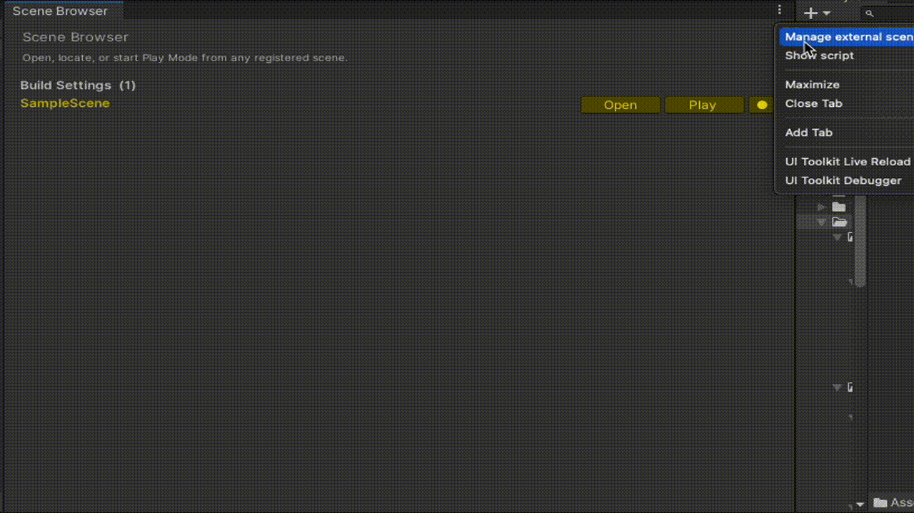
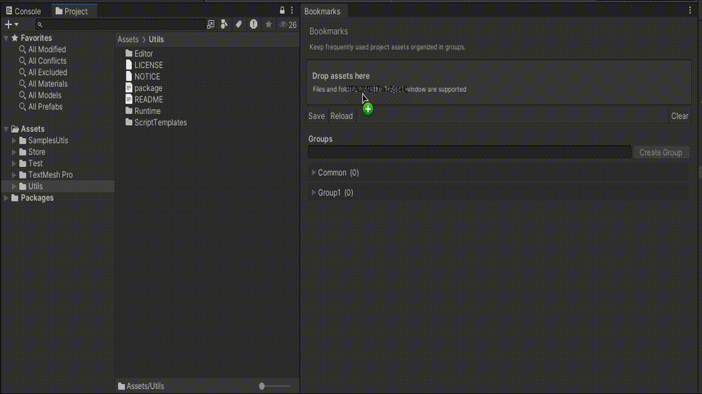
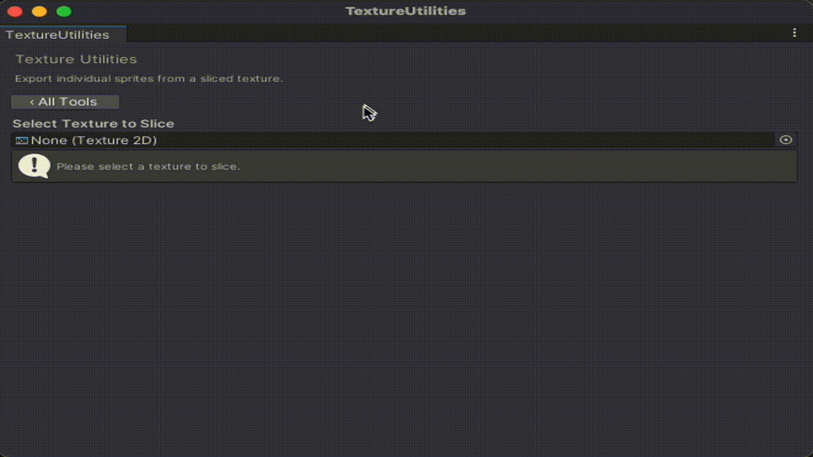
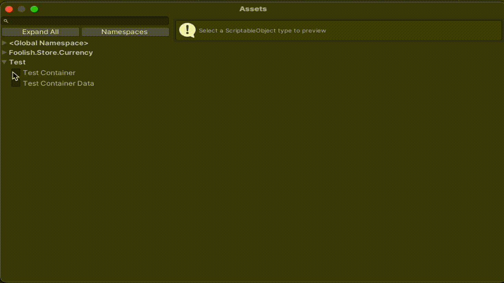

# FoolishEL Utils

[](https://unity.com/)
[](LICENSE)

A collection of reusable editor tools and runtime utilities for Unity projects.

## Requirements

- Unity 2022.3 or newer

## Installation

In Unity, open **Window → Package Manager**, select **Add package from git URL**, and enter:

```text
https://github.com/FoolishEL/UnityUtils.git?path=/Assets/Utils
```

You can also add the package directly to `Packages/manifest.json`:

```json
{
  "dependencies": {
    "com.foolish.utils": "https://github.com/FoolishEL/UnityUtils.git?path=/Assets/Utils"
  }
}
```

## Initial setup

The editor tools share a `WindowsSettingsAsset`. If one does not exist, Unity opens the setup window automatically. Create the asset anywhere inside the project and give the project a title. The title is used to keep per-project editor preferences separate.

You can also create the settings asset manually from **Assets → Create → Foolish → Windows Settings**.

## Editor tools

### Scene Browser

Open it from **Tools → Developer → Scene Browser**.

Scene Browser provides quick access to scenes from Build Settings and to additional scenes registered only in the tool.

- Open a scene in Edit Mode.
- Start Play Mode from a selected scene.
- Automatically return to the previously open scene after Play Mode.
- Locate a scene asset in the Project window.
- Add external scenes by drag and drop.
- Use **Scene Browser on front** to open it as a utility window.



### Bookmarks

Open it from **Tools → Developer → Bookmark Window Browser**.

Bookmarks keeps frequently used project assets and folders close at hand.

- Add assets and folders by drag and drop.
- Organize bookmarks into groups.
- Rename or remove groups.
- Ping or open bookmarked assets.
- Move bookmarks between groups.
- Save, reload, or clear the current list.



### Texture Utilities

Open it from **Tools → Developer → TextureUtilities**.

The window contains four texture-processing tools:

- **Slice Sprites** exports sprites from an already sliced texture as individual PNG files.
- **Merge Textures** combines textures horizontally or vertically.
- **Pack into Texture2DArray** creates a `Texture2DArray` asset from multiple textures.
- **Extend Transparent Edges** improves transparent borders by extending nearby pixel colors.



### ScriptableObject Creator

Open it from **Tools → Developer → ScriptableObjectCreator** or **Assets → Create Scriptable Object**.

Use the searchable type browser to select a concrete `ScriptableObject`, edit its initial values in a live preview, choose an asset name, and create it in the currently selected project folder. Namespace filters can hide types that are not relevant to your project.



## Runtime utilities

### SceneReference

`SceneReference` stores a scene asset in the Inspector and provides its path at runtime. Its property drawer also shows whether the scene is included in Build Settings.

### Button handlers

`ButtonView` uses managed-reference handlers to build reusable button behavior in the Inspector. The package includes handlers for Unity events, scene loading, toggles, and toggle groups.

A ready-to-import example is available from Package Manager under **Samples → Button Handler Example**.

### Containers

`AbstractContainer<T>` stores multiple `ScriptableObject` implementations as sub-assets of one container asset. Custom container inspectors can create, edit, rename, and remove these elements without leaving the parent asset.

### Other helpers

- MonoBehaviour singleton base classes
- `IInitable` lifecycle interface
- NavMesh area and agent-type attributes
- nested-object and inspector-selector attributes
- custom editor utilities and script templates

## License

This project is available under the [MIT License](LICENSE). Third-party notices are listed in [NOTICE](NOTICE).
